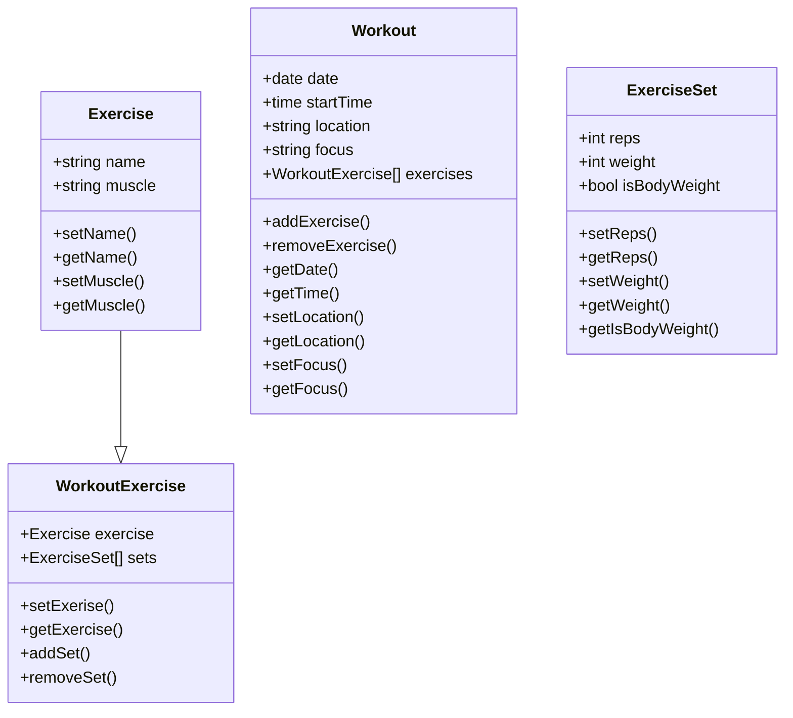

# Data Structures

## Object Definitions

```mermaid
classDiagram
  Exercise --|> WorkoutExercise
  class Workout{
    +date date
    +time startTime
    +string location
    +string focus
    +WorkoutExercise[] exercises
    +addExercise()
    +removeExercise()
    +getDate()
    +getTime()
    +setLocation()
    +getLocation()
    +setFocus()
    +getFocus()
  }
  class Exercise {
    +string name
    +string muscle
    +setName()
    +getName()
    +setMuscle()
    +getMuscle()
  }
  class WorkoutExercise {
    +Exercise exercise
    +ExerciseSet[] sets
    +setExerise()
    +getExercise()
    +addSet()
    +removeSet()
  }
  class ExerciseSet {
    +int reps
    +int weight
    +bool isBodyWeight
    +setReps()
    +getReps()
    +setWeight()
    +getWeight()
    +getIsBodyWeight()
  }
```